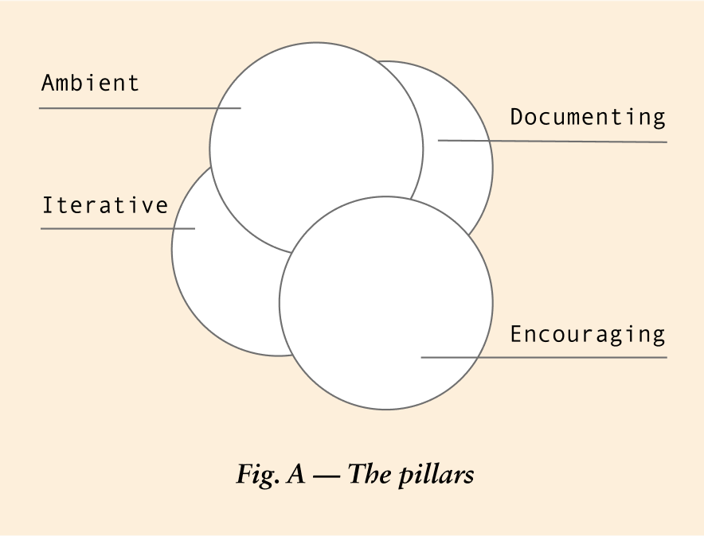
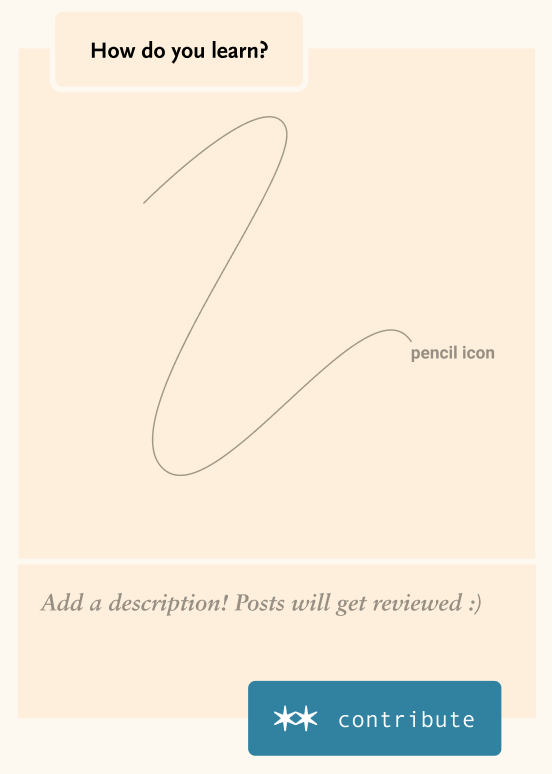

	

		
&nbsp;

		

			<h3 class="label ta-right">01</h3>
		

		

			<h3>Introduction</h3>
			
Teal Process & Company uses Leave Room for Thoughts (LRFT) as a vehicle to share the experience of a self-run trial residency, called Studio Office.

			<a href="/learn-more">

				
The specs explain our approach

				<i class="arrow right"></i>
			
</a>
			
This website is an online artifact which explores what an institution can be and opens opportunity for expressing interest in future institutional collaboration.

			
Here are the pillars that support the foundation of LRFT:

		

		
&nbsp;

	

	

		
&nbsp;

		

			
		

		
&nbsp;

	

	

		
&nbsp;

		

			
The Studio Office residency took place in Brooklyn from January 10, 2018 - February 4, 2018. We’re currently leaving space for how Leave Room for Thoughts will look moving forward.

		

		
&nbsp;

	

	<!-- section 02 -->
	

		
&nbsp;

		

			<h3 class="label ta-right">02</h3>
		

		

			<h3>Thoughts on learning</h3>
			
We encourage learning by sharing creative space. We’ve started an are.na channel that we’d love for you to contribute to. Let us know what you’re passionate about,  what you’re currently learning, or how you enjoy facilitating educational spaces. 

		

		
&nbsp;

	

	

		
&nbsp;

		

			
		

		
&nbsp;

	

	<!-- section 03 -->
	

		
&nbsp;

		

			<h3 class="label ta-right">03</h3>
		

		

			<h3>Reach out</h3>
			
We’d love to hear your thoughts or inquiries about this concept or future endeavors.

			
institution@tealprocess.com

		

		
&nbsp;

	

